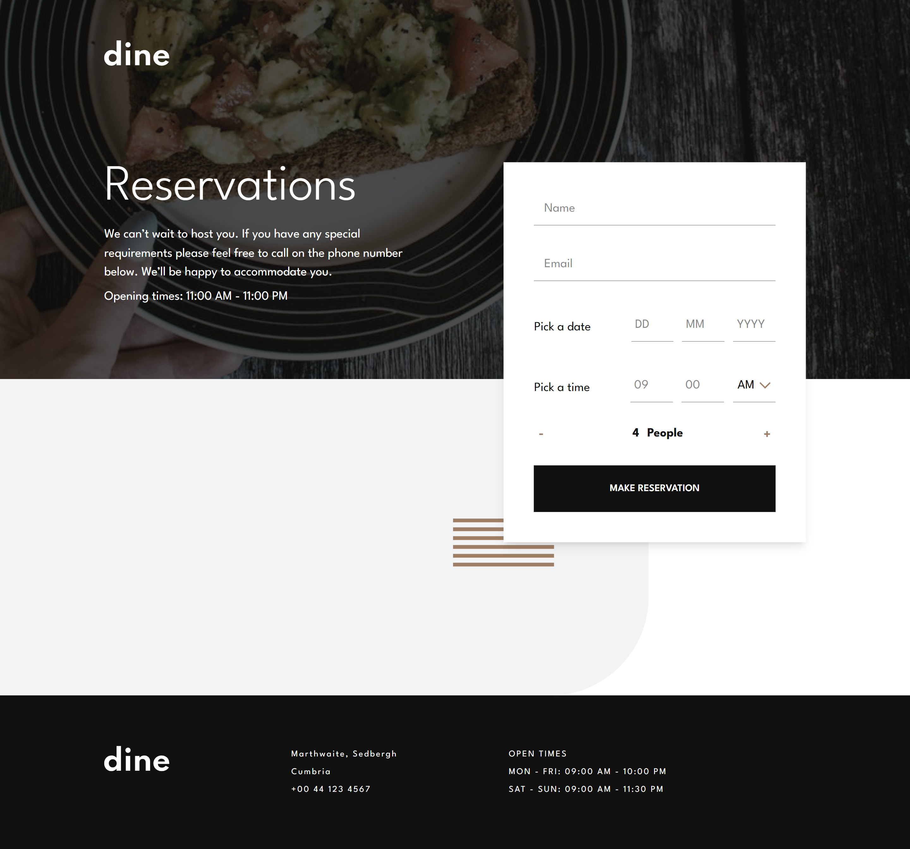
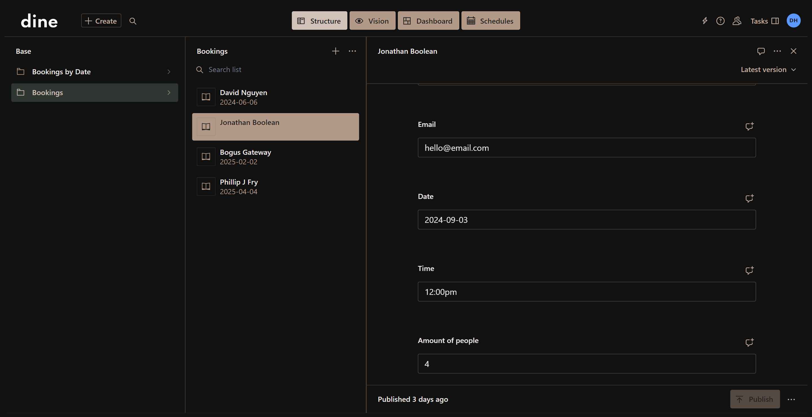

# Dine Website

## Table of contents

- [Overview](#overview)
  - [The challenge](#the-challenge)
  - [Screenshot](#screenshot)
  - [Links](#links)
- [My process](#my-process)
  - [Built with](#built-with)
  - [What I learned](#what-i-learned)
  - [Continued development](#continued-development)
  - [Useful resources](#useful-resources)
- [Author](#author)


## Overview

### The challenge

Users are be able to:

- View the optimal layout for each page depending on their device's screen size
- See hover states for all interactive elements throughout the site
- See the correct content for the Family Gatherings, Special Events, and Social Events section when the user clicks each tab
- Receive an error message when the booking form is submitted if:
  - The `Name` or `Email Address` fields are empty should show "This field is required"
  - The `Email Address` is not formatted correctly should show "Please use a valid email address"
  - Any of the `Pick a date` or `Pick a time` fields are empty should show "This field is incomplete"

### Screenshots

##### Homepage


##### Booking page



### Links

(Links to be added)
- Solution URL: [Add solution URL here](https://your-solution-url.com)
- Live Site URL: [Add live site URL here](https://your-live-site-url.com)

## My process

### Built with

- Semantic HTML5 markup
- TailwindCSS
- Flexbox
- CSS Grid
- Mobile-first workflow
- [React](https://reactjs.org/) - JS library
- [Next.js](https://nextjs.org/) - React framework
- [Sanity](https://www.sanity.io/) - Headless CMS
- [class-variance-authority](https://cva.style/docs) - CSS Class varients Library
- [clsx](https://www.npmjs.com/package/clsx) - Utility package for constructing className strings conditionally
- [tailwind-merge](https://www.npmjs.com/package/tailwind-merge) - Tailwind Library
 - [Zod](https://zod.dev/) - Form Validation library
 - [React Hook Form](https://www.react-hook-form.com/) - Form state library

### What I learned

There were several different things I've learn't and practiced while building this project. Building better forms with zod and react-hook-form libraries, building reusable components, Practicing branding the sanity studio dashboard & Creating a form that submits the form data to the sanity studio dashboard for the user to then handle.

#### Building forms with react-hook-form & zod
  Building forms with **react-hook-form** so I can handle the forms state values easier, while also being able to display user friendly error messages when inputs don't pass the validation. 
  
  I used the **zod** validation library to handle the actual validation. Checks are comprehensive and can handle the different use cases. For example, checking the basic ones, like checking if empty, checking for a valid email & checking for the correct input types like a string or a number. It can also handle custom checks, for instance, the ones I needed for this project were, checking if the requested date was not in the past, checking if the requested date was the current day and then checking if the requested time was within the opening times and also not being at a time that has already passed, and a few more different validation checks that revolved around the date and time of the booking request. Check out the bookingSchema file in the zod folder to see how I set up the validation.

#### Building reusable components with tailwind

Another thing I wanted to learn in this project was how to build reusable components with tailwind, similar to the way the shadcn library builds their components. I found out in order to make it work I needed to use three libraries/packages to make these components, class-variance-authority, clsx & tailwind-merge.

The **class-variance-authority** allows us to apply different style variants to our components, based on different strings we pass into the component through props. These strings would be things like "primary" or "secondary" and would display the components styles based on these. We Implent this be using a function called "cva", exported from the library, the function takes in a string as the first argument and an object as the second. This object would hold the different variants that we create for the component. We would then store this function into another function, which by convention would be called something like "buttonVariants". We then input the string that decides the variant we want to use, then the function will return the correct string we then can directly apply to our component.

There will be times when we still want add classes to the components on a individual basis, rather than just sticking to the already defined variants, this is where the **clsx** & **tailwind-merge** packages are used. These packages are used together to create a function, that takes in an array of strings as the argument. The first string is the string returned from the "buttonVariants" function we used, and the second is the new classes we want to add the component on the individual basis.

The **tailwind-merge** package has a function we use called "twMerge", this combines the two strings in the array into one whole string of classes, we then use the "clsx" from the **clsx** on the string to make sure there arn't any clashes in the classes we pass in and the different variant classes, and if there is any clashes, it makes sure the ones we pass in take priority of the ones already established in the variant classes.   

Together they offer a really powerful way of creating reusable components, with tailwind, through variants and dynamic classes to be able to edit those set components when needed.

##### Here is an example of a reusable button variant

Using the button component
```js
<Button variant="secondary" className="text-white border border-white">Hello</Button>
```

The reusable button component
```js
import { cva } from "class-variance-authority";
import { cn } from "@/libs/utils";
import Link from "next/link";

const Button = ({variant,className,href = "booking", ...props}) => {
  return (
    <Link
      href={href}
      className={cn(buttonVariants({ variant }), className)}
      {...props}
      title="Call to action button, which leads to the booking page"
    />
  );
};

const buttonVariants = cva("px-14 py-6 font-semibold border inline-block", {
  variants: {
    variant: {
      primary:
        "border-white text-white hover:bg-white hover:text-mirage active:border-white active:text-white active:bg-white/0",
      secondary:
        "border-codGray text-codGray hover:bg-codGray hover:text-white active:border-codGray active:text-codGray active:bg-codGray/0",
    },
  },
  defaultVariants: {
    variant: "primary",
  },
});

export default Button;
```

The cn function with **clsx** & **tailwind-merge**
```js
import { twMerge } from "tailwind-merge";
import clsx from "clsx";

const cn = (...inputs) => {
  return twMerge(clsx(inputs));
};

export { cn };
```


#### Using Sanity CMS to collect and store the booking data and branding the studio

I've been using Sanity for a while now and I thought this project was another perfect opportunity to practice.
The main reason was because a business, like a restaurant, would probably use some sort of CMS like Sanity to handle their bookings and content.

The main feature of using a CMS for this type of website would be to manage the bookings via a dashboard, where employees can check on this data when they need to. I did this by submitting the form data, after it has been validated, to the sanity dashboard, where it will show up in the dashboard immediately for the employees to use and manage.

Sanity allows us to customise the studio quite extensively, So I choose to brand the studio as much as possible by creating a theme that matched the website and also by adding the company logo, because I feel, in a real world example, this is how a CMS like this would be setup.

Sanity also allows us to customise the way we present the content, which will be very useful and helpful for employees/users handling the content on the dashboard. If I had more time I would probably add these changes, for instance, grouping the bookings into "todays bookings", "This weeks bookings", "This months booking" and etc. Presenting the content in different, more useful ways like this, would greatly incease the users overall experince in my opinion. Which is why I feel a headless CMS like Sanity would be the best tool for the job for a business like a restaurant.

*(In a real world project I feel there would be more conent that would be changable through the Sanity studio dashboard by the users, for example, opening times, menu options, gallery images and perhaps general text content of the site but I decided to only focus on the bookings for this project.)*

Sceenshot of the dashboard




### Continued development

Going forward I will be using react-hook-form with Zod together to build better, more robust and more user friendly forms. Together these libraries can create a powerful way of handling both the form state and the validation of the forms input values, while also providing user friendly error messages.

I also will be building re-usable components, in future projects with tailwind, tailwind-merge, the class-variance-authority library and the clsx package. Combining these together is a really powerful way of styling re-usable components and giving you a way to use different styling varients of these components using different string value props.

Sanity is a headless CMS platform which I have being using in my projects for a while now and I will continue to use it because I feel the developer and the user experience is a good one. Also the platform is a powerful, which offers a way to completely customise and brand the dashboard/studio and allows the users a steamlined way of managing their websites/app content and is very adaptable in many different ways.

### Useful resources

- [Sanity Docs](https://www.sanity.io/docs) - This is the overall documentation for getting started with using sanity.

- [React Hook Form](https://www.react-hook-form.com) - Documentation for react-hook-form, which helps us handle form state, validation and user friendly error handling.

- [zod](https://zod.dev/?id=error-handling) - Documentation for Zod. Zod is a TypeScript-first schema validation library, which provides a more comprehensive way of validating different forms.

- [Reusable Components tutorial using tailwind](https://www.youtube.com/watch?v=Gp95bKdmfok) - This is a youtube video, by the channel **Cosden Solutions**, on how to use the libraries class-variance-authority, clsx & tailwind-merge to create reusable react components by adding different styles based on variants. Similar to how the shadcn library creates their components.


## Author

- Portfolio Website - [David Henery](https://www.djhwebdevelopment.com)
- Frontend Mentor - [@David-Henery4](https://www.frontendmentor.io/profile/David-Henery4)
- Linkedin - [David Henery](https://www.linkedin.com/in/david-henery-725458241)


